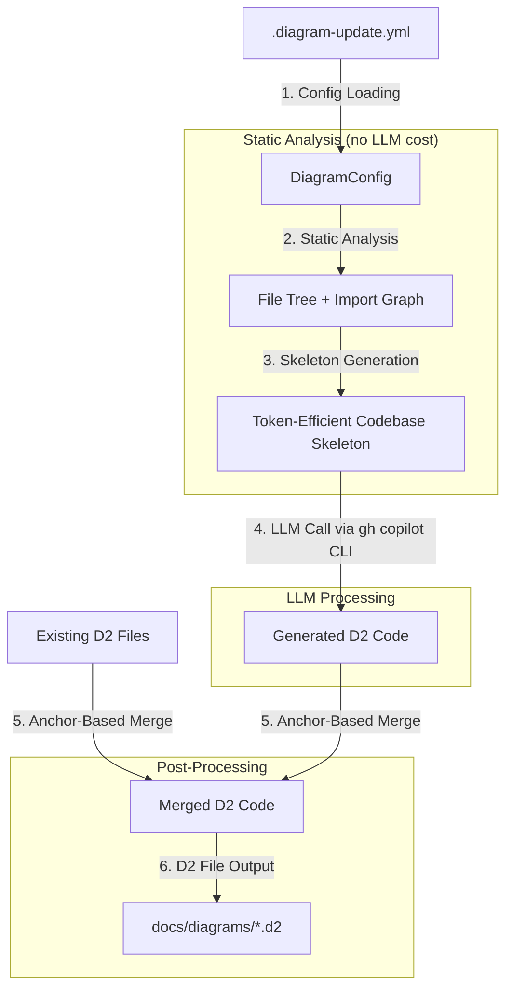
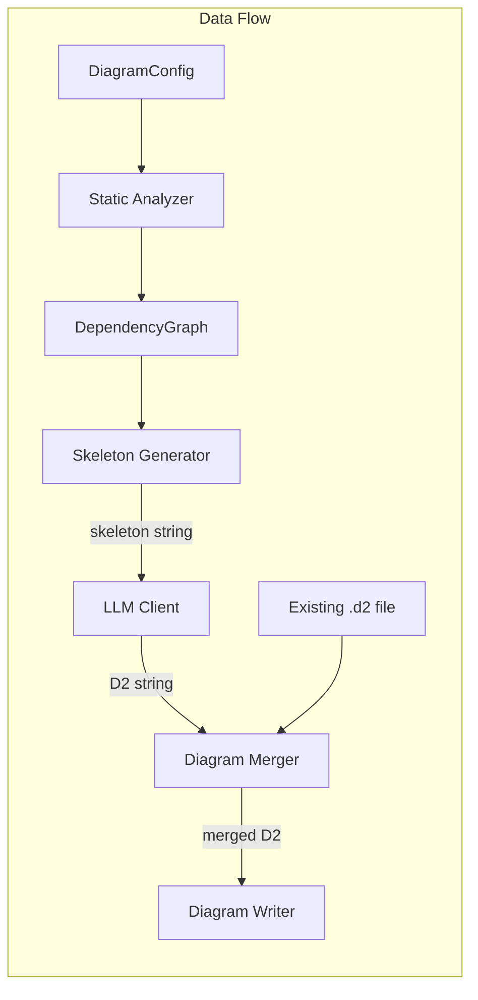

# diagram-update: Detailed Design Document

**Date:** 2026-03-18
**Status:** Draft

---

## Overview

`diagram-update` is a Python CLI tool that automatically creates and updates software architecture diagrams from source code. It uses a hybrid approach: cheap static analysis extracts file structure and dependency relationships, which are then compressed into a token-efficient "codebase skeleton" and sent to an LLM (Claude Opus 4.6 via GitHub Copilot CLI) to interpret components and generate D2 diagram code. On subsequent runs, the tool performs anchor-based merging to minimize churn in existing diagrams.

The tool supports Python, Java, and C codebases and produces three diagram types: high-level architecture, package/module dependency graphs, and sequence/flow diagrams. Output is written as `.d2` files to `docs/diagrams/`.

---

## Detailed Requirements

### Functional Requirements

1. **Diagram output format:** D2. Chosen for superior layout quality (ELK/TALA engines), update stability (key-based node identity produces minimal diffs), and token efficiency (~80-100 tokens for a 10-node graph). The trade-off of no native GitHub/GitLab rendering is acceptable -- SVGs can be pre-rendered in CI.

2. **Diagram types (v1):**
   - **High-level architecture** -- services, modules, packages and their dependencies
   - **Package/module dependency graph** -- module-level import relationships
   - **Sequence/flow diagrams** -- call flows between components

3. **Language support (v1):** Python, Java, and C. These cover scripting/OOP, enterprise OOP, and systems/procedural paradigms with distinct import styles (`import`, `import/package`, `#include`).

4. **Codebase analysis approach:** Hybrid. Static analysis extracts file structure and imports cheaply. The resulting skeleton (not raw code) is sent to the LLM for component identification and diagram generation. This avoids sending entire codebases while letting the LLM handle higher-level architectural interpretation.

5. **LLM provider:** Claude Opus 4.6 via GitHub Copilot CLI, invoked as `gh copilot -p "..." -s --model  claude-opus-4.6 --no-ask-user`. The `-s` flag strips decoration for scriptable plain-text output. No JSON mode is available, so prompts must instruct the model to output only D2 code.

6. **Update stability:** Anchor-based. Each component gets a stable ID derived from its code path (e.g., `src.auth.service` -> node key `auth_service`). On re-run, keys are compared against the existing D2 file. New nodes are added, deleted nodes removed, changed edges updated. Existing node ordering and layout hints are preserved.

7. **Sequence diagram entry points:** LLM-inferred by default, capped at the top 5 most significant flows. Users can override or supplement via config file.

8. **Output location:** `docs/diagrams/` with files named `architecture.d2`, `dependencies.d2`, `flow-{name}.d2`.

### Configuration Requirements

9. **Config file:** `.diagram-update.yml` in the project root. No CLI argument overrides for v1.

10. **Config options (v1):**
    - **Include/exclude paths** -- filter which directories/files are analyzed
    - **Component granularity** -- control whether top-level directories, packages, or individual modules are treated as components

11. **Deferred to later versions:** diagram type selection, custom component grouping, max depth, output path configuration.

### Quality Requirements

12. **Readability:** Diagrams must be human-readable -- not overloaded, with minimal crossing edges.

13. **Stability:** Re-running the tool on unchanged code must produce identical output. Changes to code must produce minimal diagram churn while maintaining readability.

14. **Efficiency:** Minimize runtime and token usage through static pre-analysis and compact skeleton representation.

### Validation Approach

15. **Dummy project testing:** Use cloned public repositories as test subjects.
16. **Readability scoring:** Generate initial diagrams and have users rate readability 1-10 until average scores are acceptable.
17. **Change stability testing:** Apply 5 different changes (small additions to large refactors) to the same codebase state, re-run the tool, and present old vs. new diagrams for "Good"/"Bad" rating.

---

## Architecture Overview

The tool operates as a six-stage pipeline:



**Stage 1 -- Config Loading:** Read `.diagram-update.yml`, validate schema, apply defaults.

**Stage 2 -- Static Analysis:** Walk the project directory, detect languages, parse imports using language-specific parsers, resolve imports to internal file paths, group files into components based on granularity setting.

**Stage 3 -- Skeleton Generation:** Convert the dependency graph and file metadata into a compact text representation (annotated file tree + key signatures + import edges) that fits within the LLM's practical token budget.

**Stage 4 -- LLM Call:** Send the skeleton to Claude Opus 4.6 via `gh copilot` in a two-pass approach. Pass 1 identifies components and relationships as structured text. Pass 2 converts them into valid D2 code.

**Stage 5 -- Anchor-Based Merge:** If an existing D2 file exists, parse both old and new files to extract node keys. Preserve ordering of unchanged nodes, add new nodes, remove deleted ones, update changed edges.

**Stage 6 -- D2 File Output:** Write the final D2 content to `docs/diagrams/`.

---

## Components and Interfaces

### Config Loader

**Responsibility:** Read and validate `.diagram-update.yml`, providing a typed configuration object to downstream components.

**Schema:**

| Field | Type | Default | Description |
|-------|------|---------|-------------|
| `include` | `list[str]` | `["**/*"]` | Glob patterns for files/directories to analyze |
| `exclude` | `list[str]` | `["tests/**", "test/**", "vendor/**", "node_modules/**", ".git/**"]` | Glob patterns to exclude |
| `granularity` | `str` | `"package"` | Component grouping level: `"directory"`, `"package"`, or `"module"` |
| `entry_points` | `list[str]` | `[]` | Override LLM-inferred flow entry points (e.g., `["src/main.py:main"]`) |
| `model` | `str` | `" claude-opus-4.6"` | Model override for `gh copilot --model` |

**Example config file (`.diagram-update.yml`):**

```yaml
# Which files to analyze
include:
  - "src/**/*"
  - "lib/**/*"

exclude:
  - "src/generated/**"
  - "tests/**"
  - "vendor/**"

# How to group files into diagram components
# "directory" = top-level directories as components
# "package"   = language-aware packages (default)
# "module"    = individual files as components
granularity: package

# Override auto-detected sequence diagram entry points
entry_points:
  - "src/main.py:main"
  - "src/api/app.py:create_app"

# LLM model (default:  claude-opus-4.6)
# model:  claude-opus-4.6
```

**Interface:**

```python
def load_config(project_root: Path) -> DiagramConfig:
    """
    Load .diagram-update.yml from project_root.
    Returns DiagramConfig with defaults applied.
    Raises ConfigError if file exists but is invalid.
    If no config file exists, returns default config.
    """
```

---

### Static Analyzer

**Responsibility:** Parse source files to extract imports and dependencies, resolve them to internal file paths, and group files into components. This is the "cheap" analysis phase -- no LLM calls, no code execution.

#### Language-Specific Parsers

Each parser implements a common interface and returns a normalized list of import records.

**Python parser:**
- Uses Python's built-in `ast` module (`ast.Import`, `ast.ImportFrom` nodes)
- Handles absolute imports, relative imports (`.`, `..`), and `from X import Y`
- Falls back to regex for files with syntax errors
- Resolves packages via `__init__.py` and namespace package conventions

**Java parser:**
- Uses regex (`^import\s+(static\s+)?([\w.]+(?:\.\*)?)\s*;`)
- Extracts `package` declarations to determine file identity
- Java imports are always single-line and semicolon-terminated, making regex reliable

**C parser:**
- Uses regex (`^\s*#\s*include\s+([<"])([^>"]+)[>"]`)
- Distinguishes system includes (`<header.h>`) from local includes (`"header.h"`)
- Only local includes are used for the dependency graph
- Collapses `.c` + `.h` pairs into single nodes

#### Import Resolver

Maps raw import strings to internal file paths within the project:

- **Python:** Converts dotted module paths to file paths, handles relative imports using the importing file's location, checks for both `module.py` and `module/__init__.py`
- **Java:** Converts dotted package paths to directory paths (e.g., `com.example.app.Service` -> `com/example/app/Service.java`), searches configured source roots (`src/main/java/`)
- **C:** Resolves `"header.h"` relative to the including file's directory, then searches configured include directories

Unresolved imports are classified as `stdlib` or `external` and excluded from the dependency graph.

#### Component Grouper

Groups files into logical components based on the `granularity` config setting:

| Granularity | Behavior |
|-------------|----------|
| `"directory"` | Each top-level directory under the source root becomes a component |
| `"package"` | Language-aware: Python packages, Java packages (below the reverse-domain prefix), C source directories |
| `"module"` | Each individual file becomes a component (most granular) |

**Interface:**

```python
def analyze(config: DiagramConfig, project_root: Path) -> DependencyGraph:
    """
    Run static analysis on the project.

    1. Walk project_root, filtered by config.include/exclude
    2. Detect language(s) and select appropriate parser(s)
    3. Parse all source files to extract imports
    4. Resolve imports to internal file paths
    5. Group files into components based on config.granularity
    6. Build and return the dependency graph

    Returns DependencyGraph with components as nodes and
    import relationships as edges.
    """
```

---

### Skeleton Generator

**Responsibility:** Convert the dependency graph and file metadata into a compact text representation suitable for LLM consumption. This is the bridge between static analysis and the LLM -- it must be information-dense but token-efficient.

**Representation format (three layers):**

1. **Annotated file tree** (~20% of token budget) -- directory structure with one-line descriptions derived from file names and detected patterns:
   ```
   src/
     auth/          -- Authentication module
     api/           -- REST API endpoints
     db/            -- Database layer
     workers/       -- Background job processing
   ```

2. **Key signatures** (~50% of token budget) -- public class/function signatures extracted via AST parsing (Python) or regex (Java, C). Ranked by reference count across the codebase (most-imported symbols first). Method bodies are stripped.
   ```
   src/auth/service.py:
     class AuthService:
       def validate_token(self, token: str) -> User
       def create_token(self, user: User) -> str
   ```

3. **Dependency edges** (~30% of token budget) -- internal import relationships as a compact list:
   ```
   api/routes.py -> auth/service.py
   api/routes.py -> db/repository.py
   auth/middleware.py -> auth/service.py
   ```

**Token budget management:**
- Target: 4,000-6,000 tokens for the codebase representation (leaves room for system prompt, instructions, and output within a practical context window)
- For projects under ~200 files: include all components in a single skeleton
- For larger projects: prioritize most-connected components, elide low-connectivity leaf modules
- Signatures are ranked by cross-file reference count and truncated to fit budget

**Interface:**

```python
def generate_skeleton(
    graph: DependencyGraph,
    project_root: Path,
    token_budget: int = 5000,
) -> str:
    """
    Generate a token-efficient codebase skeleton string.

    Combines annotated file tree, ranked signatures, and
    dependency edges into a compact text representation.
    Truncates to fit within token_budget.
    """
```

---

### LLM Client

**Responsibility:** Invoke Claude Opus 4.6 via GitHub Copilot CLI, construct prompts, parse responses, and extract valid D2 code from the output.

**Invocation:**

```bash
gh copilot -p "<prompt>" -s --model  claude-opus-4.6 --no-ask-user
```

- `-s` strips ANSI formatting for scriptable plain-text output
- `--no-ask-user` prevents interactive prompts
- The prompt is passed as a single string argument

**Two-pass approach:**

**Pass 1 -- Component Identification:**

Prompt structure:
```
You are a software architect analyzing a codebase. Given the following codebase skeleton,
identify the key architectural components and their relationships.

<codebase skeleton here>

Output a structured list:
COMPONENTS:
- id: <key>, label: <human name>, type: <service|module|database|queue|external>
- ...

RELATIONSHIPS:
- <source_id> -> <target_id>: <relationship description>
- ...

Output ONLY the structured list, no explanations.
```

Purpose: Separates the "understand the architecture" task from the "write D2 syntax" task. The LLM focuses on architectural interpretation without worrying about diagram syntax.

**Pass 2 -- D2 Generation:**

Prompt structure:
```
Convert the following software architecture components into a valid D2 diagram.

<components and relationships from Pass 1>

D2 syntax rules:
- Nodes: `key: Label`
- Connections: `a -> b: label`
- Containers: `group: Label { child1; child2 }`
- Use `{shape: cylinder}` for databases, `{shape: queue}` for queues, `{shape: cloud}` for external
- Use containers to group related components by module/service

Diagram type: <architecture|dependencies|sequence>

<If existing diagram provided:>
Preserve the structure and ordering of this existing diagram where possible.
Only add new components, remove deleted ones, and update changed relationships.
Existing diagram:
<existing D2 content>

Output ONLY valid D2 code. No markdown fences, no explanations.
```

**Response parsing:**
- Strip leading/trailing whitespace
- Remove markdown code fences (` ```d2 ` / ` ``` `) if present despite instructions
- Validate that the result contains at least one node declaration and one edge
- If the output appears malformed, retry once with an error correction prompt

**Interface:**

```python
def generate_diagram(
    skeleton: str,
    diagram_type: str,           # "architecture" | "dependencies" | "sequence"
    existing_d2: str | None,     # Existing diagram content for merge context
    model: str = " claude-opus-4.6",
) -> str:
    """
    Generate D2 diagram code via gh copilot CLI.

    Uses two-pass approach:
    1. Identify components and relationships from skeleton
    2. Convert to D2 code

    Returns raw D2 string. Raises LLMError on failure.
    """
```

---

### Diagram Merger

**Responsibility:** Merge newly generated D2 content with an existing D2 file, preserving the order and layout hints of unchanged elements while applying additions, removals, and edge updates.

**Anchor-based merge algorithm:**

1. **Parse both files:** Extract node keys and edge tuples `(source, target)` from both old and new D2 content using line-based regex parsing.

2. **Compute diff sets:**
   - `added_nodes = new_keys - old_keys`
   - `removed_nodes = old_keys - new_keys`
   - `kept_nodes = old_keys & new_keys`
   - `added_edges = new_edges - old_edges`
   - `removed_edges = old_edges - new_edges`

3. **Build merged output:**
   - Start with the existing D2 file's content
   - Remove lines belonging to `removed_nodes` (including their container blocks)
   - Remove lines belonging to `removed_edges`
   - Append `added_nodes` before the first edge declaration
   - Append `added_edges` at the end
   - Preserve all existing ordering, comments, styling, and layout hints for `kept_nodes`

4. **Edge update handling:** If an edge exists in both old and new but with a different label, update the label in-place.

**D2 file parsing** uses line-based regex, which is sufficient for the tool's own output (which has a predictable, flat-ish structure):
- Node pattern: `^(\w[\w.]*)\s*(?::\s*(.+?))?(?:\s*\{)?$`
- Edge pattern: `^([\w.]+)\s*(->|<->|<-|--)\s*([\w.]+)(?:\s*:\s*(.+))?`
- Container blocks are tracked by brace depth

**Interface:**

```python
def merge_diagrams(old_d2: str, new_d2: str) -> str:
    """
    Merge new D2 content into existing D2 content.

    Preserves ordering and layout of unchanged nodes/edges.
    Adds new nodes, removes deleted nodes, updates changed edges.

    If old_d2 is empty, returns new_d2 unchanged.
    """
```

---

### Diagram Writer

**Responsibility:** Write final D2 files to the output directory, creating the directory structure if needed.

**File naming conventions:**

| Diagram Type | Filename |
|-------------|----------|
| High-level architecture | `docs/diagrams/architecture.d2` |
| Package dependencies | `docs/diagrams/dependencies.d2` |
| Sequence/flow | `docs/diagrams/flow-{name}.d2` (name derived from entry point) |

Each generated D2 file includes a `vars.d2-config` block specifying the layout engine:

```d2
vars: {
  d2-config: {
    layout-engine: elk
  }
}

direction: right

# ... diagram content ...
```

**Interface:**

```python
def write_diagram(
    d2_content: str,
    diagram_type: str,
    project_root: Path,
    flow_name: str | None = None,
) -> Path:
    """
    Write D2 content to docs/diagrams/.
    Creates the directory if it doesn't exist.
    Returns the path to the written file.
    """
```

---

## Data Models

### DependencyGraph

```python
@dataclass
class DependencyGraph:
    """Complete dependency graph of a project."""
    components: list[Component]       # All identified components
    relationships: list[Relationship] # Edges between components
    files: dict[str, FileInfo]        # Metadata for each analyzed file
    languages: list[str]              # Detected languages (e.g., ["python", "java"])
    source_roots: list[Path]          # Detected source root directories
```

### Component

```python
@dataclass
class Component:
    """A logical grouping of source files."""
    id: str                           # Stable key (e.g., "auth_service")
    label: str                        # Human-readable label (e.g., "Auth Service")
    files: list[Path]                 # Files belonging to this component
    sub_components: list[Component]   # Nested components (for container grouping)
    component_type: str               # "module" | "package" | "service" | "database" | "queue" | "external"
```

### Relationship

```python
@dataclass
class Relationship:
    """A directed dependency between two components."""
    source: str                       # Source component ID
    target: str                       # Target component ID
    rel_type: str                     # "imports" | "calls" | "uses" | "produces" | "consumes"
    label: str                        # Human-readable edge label
    weight: int                       # Number of import statements backing this edge
```

### FileInfo

```python
@dataclass
class FileInfo:
    """Metadata about a single source file."""
    path: Path                        # Absolute file path
    language: str                     # "python" | "java" | "c"
    imports: list[ImportInfo]         # Raw extracted imports
    signatures: list[str]            # Public function/class signatures
    line_count: int                   # Total lines of code
    component_id: str                # ID of the component this file belongs to
```

### ImportInfo

```python
@dataclass
class ImportInfo:
    """A single import statement extracted from a source file."""
    module: str                       # Module/package being imported
    names: list[str]                  # Specific names imported (for from-imports)
    level: int                        # Relative import level (Python only, 0=absolute)
    is_internal: bool                 # True if resolved to a project file
    resolved_path: Path | None        # Resolved file path (None if external)
    lineno: int                       # Line number in source
```

### DiagramConfig

```python
@dataclass
class DiagramConfig:
    """Configuration loaded from .diagram-update.yml."""
    include: list[str]                # Glob patterns to include
    exclude: list[str]                # Glob patterns to exclude
    granularity: str                  # "directory" | "package" | "module"
    entry_points: list[str]           # Override flow entry points
    model: str                        # LLM model name for gh copilot
```

### Component interactions



---

## Error Handling

### Missing `gh copilot` CLI

- **Detection:** Check for `gh` binary via `shutil.which("gh")`, then verify the copilot extension is installed by running `gh copilot --version`.
- **Error:** `ToolError("GitHub CLI with Copilot extension is required. Install: https://cli.github.com and run 'gh extension install github/gh-copilot'")`
- **Severity:** Fatal -- the tool cannot function without it.

### Invalid Config File

- **Detection:** YAML parse errors or schema validation failures (unexpected keys, wrong types).
- **Error:** `ConfigError("Invalid .diagram-update.yml: {details}")` with line number if available.
- **Behavior:** Exit with non-zero status and clear error message. Do not silently use defaults when a config file exists but is malformed.

### Unsupported Language Files

- **Detection:** Files matching include patterns but having unrecognized extensions.
- **Behavior:** Skip silently. Log a debug message. The tool only processes `.py`, `.java`, `.c`, `.h`, `.cpp`, `.hpp` files. Mixed-language projects are supported -- each file is handled by its language parser.

### Source File Parse Errors

- **Python:** If `ast.parse()` raises `SyntaxError`, fall back to regex-based import extraction. Log a warning.
- **Java/C:** Regex parsing is inherently tolerant of syntax errors in non-import code. Only log if a file contains zero parseable imports.

### LLM Response Parsing Failures

- **Empty response:** Retry once. If still empty, raise `LLMError("Empty response from gh copilot")`.
- **Non-D2 output:** If the response contains no recognizable D2 syntax (no `->` edges, no node declarations), retry with a more explicit prompt. After second failure, raise `LLMError` with the raw response for debugging.
- **Markdown fences:** Strip automatically (` ```d2 ` and ` ``` ` wrappers).
- **Partial D2:** If some valid D2 is present but mixed with explanatory text, attempt to extract the D2 portion between the first node declaration and the last edge.

### Empty or Malformed D2 Output

- **Validation:** After generation, verify the D2 contains at least one node and one edge. A diagram with only nodes and no edges is likely a generation failure.
- **Existing diagram protection:** If merge would result in removing more than 80% of existing nodes, warn the user and write to a `.d2.new` file instead of overwriting.

### Subprocess Failures

- **`gh copilot` timeout:** Set a 60-second timeout on the subprocess call. Raise `LLMError("gh copilot timed out after 60s")`.
- **`gh copilot` non-zero exit:** Capture stderr and include it in the error message.
- **Authentication errors:** Detect "not authenticated" or "token expired" patterns in stderr and provide a helpful message: `"Run 'gh auth login' to authenticate."`

---

## Testing Strategy

### Unit Tests

**Parser tests (per language):**

- **Python AST parser:**
  - Simple `import X` and `from X import Y` statements
  - Relative imports (`.`, `..`, `...`)
  - Multiline parenthesized imports
  - `from __future__` imports (should be ignored for dependency graphs)
  - Files with syntax errors (graceful fallback to regex)
  - Namespace packages (no `__init__.py`)

- **Java regex parser:**
  - Standard imports, wildcard imports, static imports
  - Package declaration extraction
  - Files with multiple classes
  - Annotation imports

- **C regex parser:**
  - System includes (`<stdio.h>`) vs local includes (`"myheader.h"`)
  - Path-based includes (`"utils/helpers.h"`)
  - Includes inside `#ifdef` blocks
  - Files mixing `.c` and `.h` patterns

**Import resolver tests:**
- Python relative import resolution from various directory depths
- Java package-to-path mapping with multiple source roots
- C header resolution with multiple include directories
- External vs internal import classification

**Skeleton generator tests:**
- Token budget enforcement (output must not exceed specified limit)
- Correct ranking of signatures by reference count
- All three sections present (file tree, signatures, dependency edges)
- Empty/minimal project handling

**D2 merger tests:**
- Adding new nodes to an existing diagram
- Removing deleted nodes (including container blocks)
- Updating edge labels
- Preserving ordering of unchanged nodes
- Preserving comments and layout hints
- Edge case: merging into an empty file (first run)
- Edge case: no changes (idempotent)

**Config loader tests:**
- Valid config with all fields
- Minimal config (defaults applied)
- Missing config file (defaults used)
- Invalid YAML syntax
- Unknown config keys (warning but no error)
- Invalid granularity value

### Integration Tests

Run against sample projects that exercise the full pipeline:

- **Small Python project:** ~10 files, flat layout, simple import graph
- **Medium Java project (Maven):** ~50 files, `src/main/java` layout, package hierarchy
- **C project:** ~20 files with headers, include directory structure
- **Mixed-language project:** Python + C with shared directory structure

Each integration test verifies:
1. Config is loaded correctly
2. All internal imports are resolved
3. External imports are excluded
4. Components are grouped at the expected granularity
5. The skeleton fits within the token budget
6. The generated D2 is syntactically valid (verified by running `d2 fmt` if available)

### Validation Test Suite

The "dummy project" approach from the requirements:

1. **Clone 3-5 public repositories** spanning different languages and sizes (e.g., a Flask app, a Spring Boot service, a C library).

2. **Initial diagram generation:** Run the tool, generate all three diagram types, have a user rate readability on a 1-10 scale. Iterate until average scores are acceptable.

3. **Change stability testing:** For each dummy project:
   - Save the initial diagram state
   - Apply 5 changes of varying scope:
     1. Add a new utility function (small, leaf node)
     2. Add a new module with 2-3 files (medium, new component)
     3. Rename a module (refactor, should update keys)
     4. Add a cross-cutting dependency (new edge between existing components)
     5. Large architectural refactor (move modules between packages)
   - Re-run the tool after each change
   - Present old vs. new diagram pairs for "Good"/"Bad" rating
   - A "Good" result means the diagram changed in a way that accurately and minimally reflects the code change

---

## Appendices

### A. Technology Choices

| Decision | Choice | Rationale |
|----------|--------|-----------|
| **Diagram format** | D2 over Mermaid/PlantUML | Superior layout quality (ELK/TALA), key-based node identity for stable diffs, token-efficient syntax, first-class container support for architecture diagrams. Mermaid has wider native rendering support but weaker layout and limited container syntax. |
| **LLM invocation** | `gh copilot` CLI over GitHub Models API | Claude Opus 4.6 is not available through the GitHub Models API (`models.github.ai`). It is only accessible on GitHub through Copilot. The `gh copilot -s` flag provides scriptable plain-text output suitable for automation. |
| **Analysis approach** | Hybrid (static + LLM) over pure static or pure LLM | Pure static analysis cannot infer architectural intent or meaningful component labels. Pure LLM analysis requires sending entire codebases, which is prohibitively expensive in tokens. The hybrid approach uses static analysis for structure and the LLM only for interpretation. |
| **D2 generation method** | Plain text strings over py-d2 library | py-d2 (v1.0.1) lacks support for containers, sequence diagrams, layout config, and many D2 features. Generating D2 as plain text provides full control over all syntax features. |
| **Python import parsing** | `ast` module over regex | `ast` handles multiline imports, comments, string literals, and relative import levels correctly. It is part of the standard library with zero dependencies. Regex is used only as a fallback for files with syntax errors. |
| **Java/C import parsing** | Regex over AST tools | Java imports are single-line and regular enough for reliable regex extraction. C `#include` directives follow a simple pattern. No external parser dependencies needed. |
| **Implementation language** | Python | Excellent ecosystem for API calls, file traversal, AST parsing. Widely available. `ast` module in standard library. |

### B. Research Findings Summary

**D2 Syntax Generation:**
- D2 syntax is simple enough that LLMs (GPT-4o, Claude, Gemini) can generate it without special training. No "magic prompt" needed.
- Container syntax (`group: { child1; child2 }`) maps naturally to software packages/modules.
- ELK layout engine (bundled with D2) produces the best results for complex node-link diagrams.
- Sequence diagrams use `shape: sequence_diagram` on a container -- actors are declared as nodes, messages as edges.
- py-d2 library is too limited for production use (no containers, no sequence diagrams, no layout config). Plain text generation is recommended.
- D2 file parsing can be done with line-based regex for simple cases. No Python-native D2 parser exists; the official parser is in Go.

**GitHub Models API:**
- Claude models are NOT available through the GitHub Models API. The API supports OpenAI, Meta, DeepSeek, Microsoft, and xAI models only.
- Claude IS available through GitHub Copilot (as a model choice for Pro/Business/Enterprise users).
- The `gh copilot -p "..." -s --model  claude-opus-4.6 --no-ask-user` command provides scriptable access to Claude via Copilot.
- No JSON mode or structured output is available through `gh copilot` -- prompts must request specific output formats.

**Static Analysis:**
- Python: `ast` module is the recommended approach. Handles all import forms reliably. `ImportExtractor(ast.NodeVisitor)` pattern extracts `ast.Import` and `ast.ImportFrom` nodes.
- Java: Regex works well because imports are always single-line, semicolon-terminated, and at the top of the file. Package declarations provide file identity.
- C: Regex extracts `#include` directives. Bracket style (`<>` vs `""`) reliably distinguishes system from local headers. Header/source pairs should be collapsed into single component nodes.
- Project layout detection (Python src-layout vs flat, Maven/Gradle, C with include dirs) is needed to find source roots.
- Import classification (internal vs stdlib vs external) uses file path resolution against the project tree and `sys.stdlib_module_names` (Python 3.10+).

**Token-Efficient Summarization:**
- A code map at 5-10% of original code size captures ~90% of architectural understanding.
- The optimal representation combines three layers: annotated file tree + ranked signatures + dependency edges.
- Aider's repo map uses tree-sitter + PageRank-style ranking with a default budget of 1,024 tokens.
- For projects under ~200 files, a single LLM call with 4-6K tokens of codebase representation is practical.
- For larger projects, a two-call progressive disclosure approach is better: overview first, then targeted detail.
- Token budget allocation: ~400 tokens for system prompt, ~150 for D2 example, ~4-6K for codebase, ~200 for instructions, ~3-5K reserved for output.
- Two-pass generation (components first, then D2 syntax) separates architectural interpretation from syntax production, reducing errors in both.

### C. Alternative Approaches Considered

**Full LLM analysis (rejected):**
Send raw source code to the LLM and let it identify everything. Rejected because a medium project (25K LOC) would consume ~75K tokens of input per call. Multiple diagram types would multiply this cost. The hybrid approach achieves comparable quality with ~5K tokens of input.

**Pure static analysis (rejected):**
Generate diagrams entirely from import graphs and directory structure without any LLM involvement. Rejected because static analysis alone cannot infer meaningful component labels, identify architectural boundaries that don't align with directory structure, or determine which relationships are architecturally significant vs. incidental utility imports.

**GitHub Models API (rejected for v1):**
The original plan was to use the GitHub Models API for programmatic LLM access with structured output. However, Claude Opus 4.6 is not available through this API. The API only offers OpenAI, Meta, DeepSeek, Microsoft, and xAI models. `gh copilot` CLI provides Claude access but without JSON mode, requiring prompt-based output formatting.

**py-d2 library for D2 generation (rejected):**
py-d2 provides typed Python classes for building D2 syntax. Rejected because version 1.0.1 lacks support for containers/groups (first-class in D2 syntax but only basic nesting in py-d2), sequence diagrams, layout engine configuration, and many styling options. Plain text generation provides full feature coverage with minimal additional complexity.

**tree-sitter for all languages (deferred):**
Using tree-sitter for AST parsing across all languages would provide more robust signature extraction and cross-reference analysis. Deferred because Python's `ast` module handles Python files without dependencies, and Java/C imports are simple enough for regex. tree-sitter may be added later if signature extraction quality becomes a bottleneck.

**Graph ranking (PageRank) for symbol prioritization (simplified for v1):**
Aider's repo map uses a PageRank-like algorithm to rank symbols by importance. For v1, a simpler heuristic is used: rank by import reference count (how many other files import a given module). This is less sophisticated but adequate for architecture-level diagrams where individual symbols matter less than module-level relationships.
